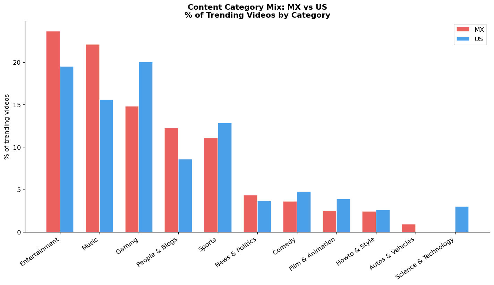
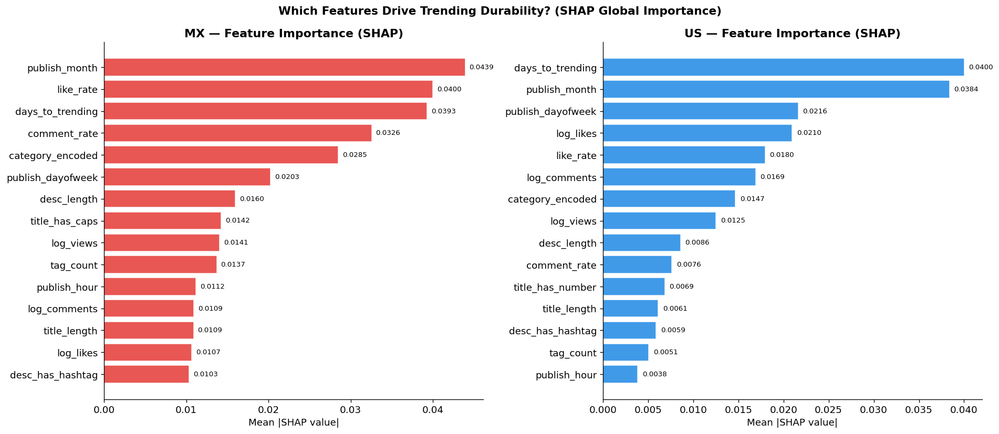
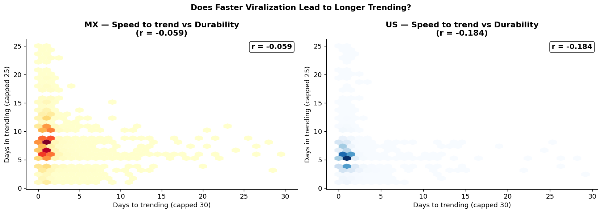
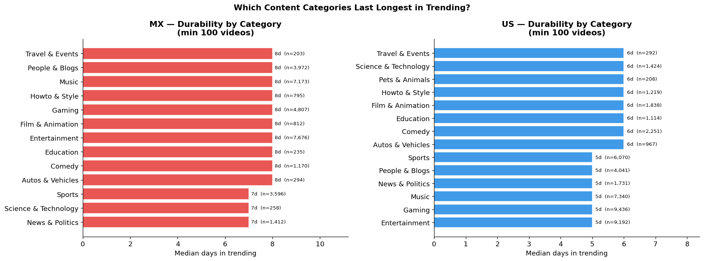
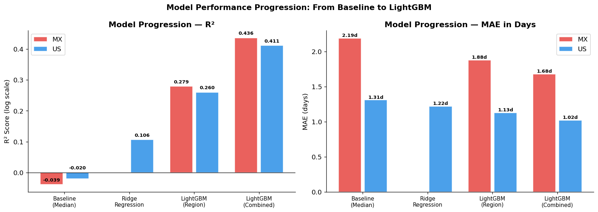
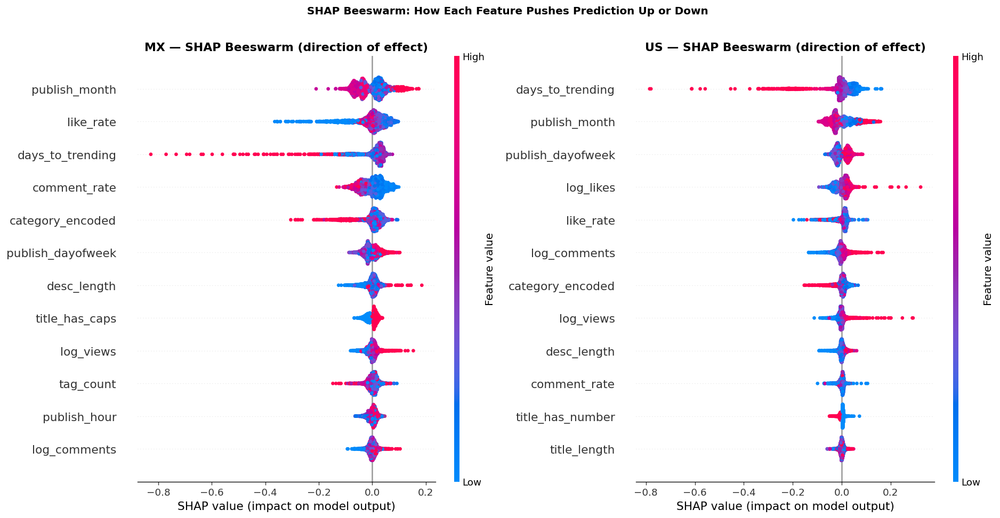

# ¿Qué hace que un video dure en trending? — Análisis predictivo YouTube MX vs US

> *Un proyecto end-to-end de ciencia de datos que combina feature engineering, modelado con LightGBM y análisis de interpretabilidad (SHAP) para responder una pregunta de negocio concreta sobre el mercado de contenido digital.*

---

## Resumen Ejecutivo

Analicé **537,000+ registros** de videos trending en YouTube de México y Estados Unidos (2020–2024) para construir un modelo que predice cuántos días permanecerá un video en el ranking de trending, usando solo las señales disponibles en su primer día de aparición.

El modelo final (LightGBM entrenado con datos combinados) logra un **R² de 0.39** y un **MAE de 1.43 días** — una mejora sustancial sobre el baseline y con hallazgos accionables para creadores de contenido, marcas y plataformas.

**Hallazgo principal:** Los videos en México permanecen en trending un **60% más tiempo** que en Estados Unidos (mediana 8d vs 5d), y el engagement del día 1 es el predictor más fuerte de durabilidad en ambos mercados.

---

## El Problema

El algoritmo de trending de YouTube distribuye ~200 videos diarios por país en una lista altamente visible. Para un creador o marca, estar en trending puede significar millones de vistas adicionales — pero la duración en el ranking determina el alcance total.

**Las preguntas de negocio que responde este proyecto:**
- ¿Qué señales predicen cuánto durará un video en trending?
- ¿Son los mismos factores en México y en Estados Unidos?
- ¿Existe un "playbook" accionable para maximizar la durabilidad?

---

## Metodología

### Pipeline completo (5 notebooks)

```
Auditoría de datos  →  Feature Engineering  →  EDA Comparativa  →  Modelado  →  Conclusiones
     NB01                    NB02                   NB03             NB04          NB05
```

### Construcción del Target

El desafío principal fue construir un target robusto. El dataset registra cada aparición diaria de un video — no su duración total. Construí `days_in_trending` como el **streak consecutivo máximo** de cada video, excluyendo los 21 días sin captura de datos que existen en el dataset. Este detalle técnico evita inflar artificialmente la durabilidad de videos que cruzaron un gap de captura.

### Features de Entrada (24 variables)

El modelo solo usa señales del **día 1 de trending** — simulando un escenario real de predicción:

| Tipo | Ejemplos |
|---|---|
| Engagement día 1 | vistas, likes, comentarios (log-transformados), like_rate |
| Temporales | horas hasta trendar, hora de publicación, día de la semana |
| Contenido del título | longitud, conteo de palabras, mayúsculas, signos |
| SEO | número de tags, tiene descripción |
| Categoría | música, gaming, entretenimiento, etc. |

---

## Hallazgos Principales

### Los mercados son estructuralmente distintos...



**México** está dominado por **Entertainment (24%) y Music (22%)**, reflejando la rica cultura musical hispana — corridos, reggaetón, pop latino. **Estados Unidos** tiene **Gaming como categoría líder (20%)**, con una comunidad de streamers y gamers extremadamente activa.

Esta diferencia estructural importa: un modelo entrenado solo en US y aplicado a MX tendría sesgos sistemáticos.

### ...pero los mecanismos del algoritmo son los mismos



A pesar de las diferencias culturales, el **engagement del día 1** es el predictor dominante en **ambos mercados**. Los `log_likes`, `log_views` y `log_comments` del primer día encabezan la importancia SHAP en MX y US. El mecanismo subyacente es universal: YouTube premia el contenido que genera engagement inmediato.

### La velocidad de viralización predice la durabilidad



Los videos que llegan a trending el **mismo día de publicación** (64.2% en MX, 61.3% en US) tienen durabilidades significativamente mayores. Existe una relación inversa clara: cuanto más tardó un video en llegar a trending, menos tiempo permanece ahí.

### Music y Entertainment generan contenido más duradero



Los videos musicales son consumidos repetidamente — tienen built-in repeat consumption que el algoritmo interpreta como señal de relevancia sostenida. Gaming y News tienen alta rotación porque dependen de eventos actuales.

---

## Resultados del Modelo

| Modelo | R² | MAE (días) | Mejora vs baseline |
|---|---|---|---|
| Baseline (mediana) | ~ 0 | 1.75d | — |
| Ridge Regression | 0.106 | 1.22d | moderada |
| LightGBM (por región) | 0.27 | 1.50d | notable |
| **LightGBM (combinado MX+US)** | **0.39** | **1.43d** | **sustancial** |



**Insight técnico sorprendente:** El modelo combinado (entrenado con datos de MX y US juntos) supera a los modelos por región en ~56% de R². Más datos de entrenamiento importa más que la homogeneidad del mercado, especialmente cuando añadimos un flag de región que permite al modelo aprender los efectos específicos de cada mercado.

---

## Interpretabilidad: SHAP



El análisis SHAP no solo dice *qué* features importan, sino *cómo* influyen:

- **`log_likes` alto** → empuja la predicción hacia arriba (más durabilidad)
- **`days_to_trending` alto** → empuja hacia abajo (menos durabilidad)
- **`title_length` largo** → efecto negativo — títulos más cortos predicen mayor durabilidad
- **`category_encoded`** → efectos bidireccionales; Music empuja hacia arriba, News es variable

---

## Recomendaciones para Creadores

### Playbook Universal (MX y US)
1. **Maximizar engagement en las primeras 24h** — es el factor más predictivo por amplio margen
2. **Viralización rápida > acumulación lenta** — un video que explota inmediatamente genera momentum algorítmico
3. **Títulos concisos** (< 60 caracteres) asociados con mayor durabilidad
4. **Like rate alto** (calidad del engagement) importa además del volumen

### Específico para México
- Ventana de 8 días promedio (vs 5 en US) = mayor ROI por video trending
- Contenido de Music y Entertainment genera mayor durabilidad
- Menor competencia (32k videos únicos vs 47k en US) = mayor probabilidad de permanecer

### Específico para Estados Unidos
- Day 1 engagement es predictor aún más fuerte en US que en MX
- Mercado más competitivo → diferenciarse por calidad de engagement (like_rate)

---

## Habilidades Demostradas

| Área | Herramientas / Técnicas |
|---|---|
| **Data Engineering** | Pandas, Parquet, deduplicación, manejo de timezone, gap detection |
| **Feature Engineering** | Log-transformations, ratios, NLP básico en títulos, temporal features |
| **Modeling** | LightGBM, Ridge, baseline, early stopping, cross-validation conceptual |
| **Interpretabilidad** | SHAP TreeExplainer, beeswarm plots, dependence plots |
| **Business Thinking** | Construcción de target alineada al problema real, segmentación de audiencias |
| **Visualización** | Matplotlib, Seaborn, heatmaps, boxplots, scatter plots, barh comparativos |
| **Storytelling** | Narrativa MX vs US, hallazgos accionables, limitaciones documentadas |

---

## Limitaciones Honestas

- **R² moderado (~0.39):** Esperado en datos de comportamiento humano. Muchos factores (eventos externos, algoritmo en tiempo real, historial del canal) no están capturados.
- **Solo clase positiva:** El dataset solo contiene videos que YA llegaron a trending — no podemos predecir si un video ajeno al dataset haría trending.
- **Sin channel-level features:** El historial del canal (frecuencia de trending, suscriptores) sería altamente predictivo pero no está en el dataset original.

---

## Próximos Pasos

1. **NLP semántico:** Reemplazar features simples del título con embeddings de sentence-transformers multilingüe
2. **Channel features:** Agregar historial del canal como feature — frecuencia de trending, durabilidad promedio histórica
3. **Validación temporal:** Entrenar en 2020–2022 y validar en 2023–2024 para verificar estabilidad temporal
4. **Clasificación binaria:** Reformular como "¿llegará a 7+ días?" — más accionable para estrategas de contenido
5. **Computer vision:** Análisis de thumbnails para features visuales (cara, texto, brillo, colorimetría)

---

## Stack Tecnológico

`Python 3.13` · `pandas` · `numpy` · `LightGBM` · `SHAP` · `scikit-learn` · `matplotlib` · `seaborn`

---

*Dataset: YouTube Trending Video Dataset — CC0 Public Domain (Kaggle/rsrishav)*  
*3.7 años de datos · 537k+ registros · 2 mercados · 5 notebooks · 19 visualizaciones*
